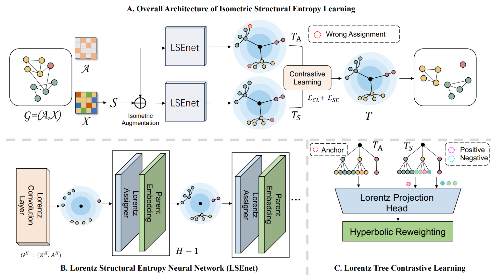
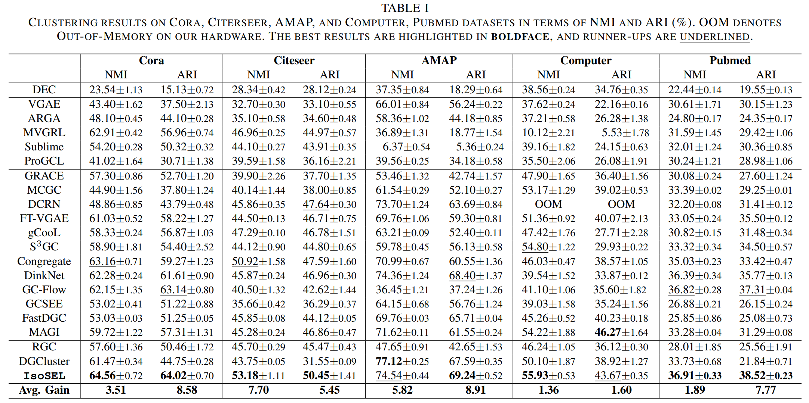
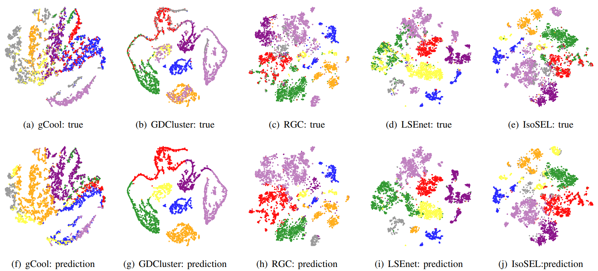
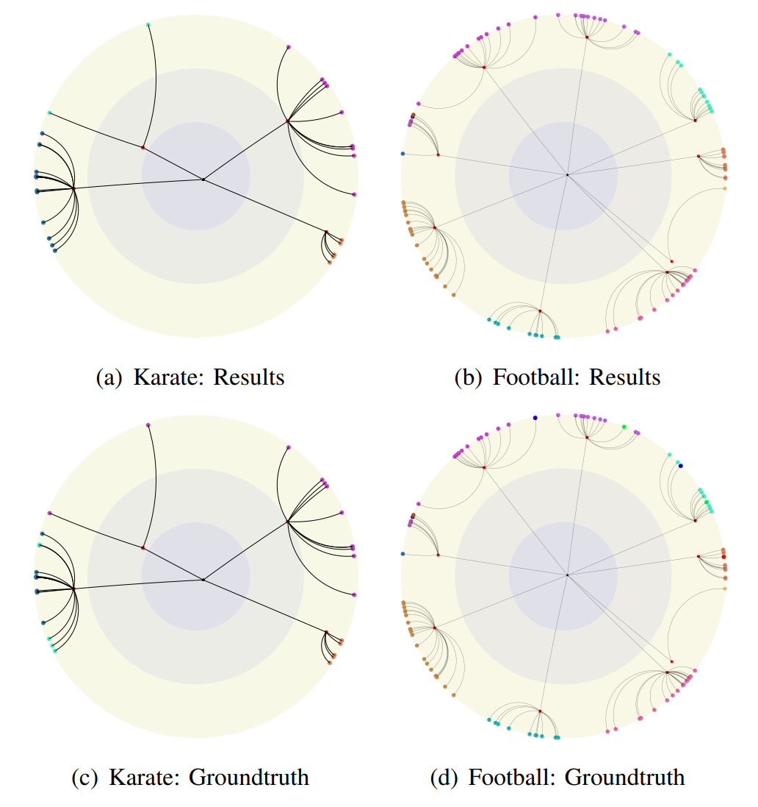

# IsoSEL: Isometric Structural Entropy Learning for Deep Graph Clustering in Hyperbolic Space

The Extension of [ICML2024 (**Oral**)]: [LSEnet: Lorentz Structural Entropy Neural Network for Deep Graph Clustering](https://arxiv.org/abs/2405.11801).

## Get Started

Firstly, install all the required pakages and ```Python==3.9.0```.

```shell
cd ./DSE_clustering
pip install -r requirements.txt
```

Run ```main.py``` to train and test model.

```shell
python main.py
```

You can design your own configurations in ```configs``` directory by ```.json``` files.

Pay attention to the following codes to load or save your configurations:

```python
parser = argparse.ArgumentParser(description='Lorentz Structural Entropy')
# ...add_argument
configs = parser.parse_args()

# save to json file
with open(f'./configs/{configs.dataset}.json', 'wt') as f:
    json.dump(vars(configs), f, indent=4)

# load from json file
configs_dict = vars(configs)
with open(f'./configs/{configs.dataset}.json', 'rt') as f:
    configs_dict.update(json.load(f))
configs = DotDict(configs_dict)

f.close()

```

## Model Architecture

<div align=center>

</div>
<div align=center>

Figure 1. In *IsoSEL*, we learn the partitioning tree of structural information with the *LSEnet* in hyperbolic space, and then propose Lorentz tree contrastive
learning to refine the partitioning tree for graph clustering without K.

## Main Experimental Results

<div align=center>

</div>
<div align=center>

## Visualization

<div align=center>

</div>
<div align=center>
Figure 2. Visualization of real and predicted data.
</div>
<br><br>
<div align=center>

</div>
<div align=center>
Figure 2. Visualization of hyperbolic partitioning trees.
</div>
